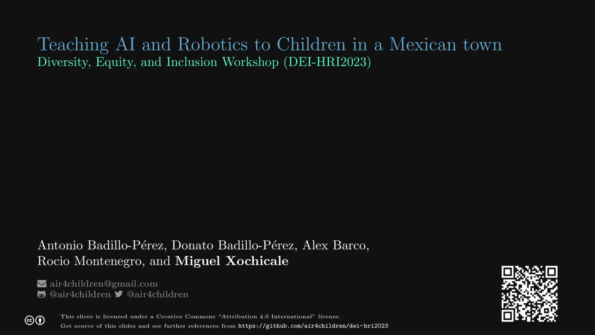

# Teaching AI and Robotics to Children in a Mexican town
Authors:   
Antonio Badillo-Perez, Donato Badillo-Perez, Alex Barco, Rocio Montenegro and Miguel Xochicale    

Abstract:   
In this paper, we present a pilot study aiming to investigate the challenges of teaching AI and Robotics to children in  low- and middle-income countries. Challenges such as the little to none experts and the limited resources in a Mexican town to teach AI and Robotics were addressed with the creation of inclusive learning activities with Montessori method and open-source educational robots. For the pilot study, we invited 14 participants of which 10 were able to attend, 6 male and 4 female of (age in years: mean=8 and std=$\pm$1.61) and four instructors of different teaching experience levels to young audiences. We reported results of a four-lesson curriculum that is both inclusive and engaging. We showed the impact on the increase of general agreement of participants on the understanding of what engineers and scientists do in their jobs, with engineering attitudes surveys and Likert scale charts from the first and the last lesson. We concluded that this pilot study helped children coming from low- to mid-income families to learn fundamental concepts of AI and Robotics and aware them of the potential of AI and Robotics applications which might rule their adult lives. Future work might lead (a) to have better understanding on the financial and logistical challenges to organise a workshop with a major number of participants for reliable and representative data and (b) to improve pretest-posttest survey design and its statistical analysis. The resources to reproduce this work are available at \url{https://github.com/air4children/dei-hri2023}.

[](https://arxiv.org/abs/2303.03956) 
[](https://github.com/air4children/dei-hri2023/blob/pdfs/slides.pdf) 
[](https://github.com/air4children/dei-hri2023/blob/pdfs/paper.pdf)
[](https://github.com/air4children/dei-hri2023/actions/workflows/citex.yml)
**(This work is 100% Reproducible with [free-cortex-framework](https://github.com/free-cortex/framework/tree/main/workflow))**

## 7-8 minutes video


## Inclusive HRI II (13th of March 2023, Stockholm, Sweden)
Equity and Diversity in Design, Application, Methods, and Community
https://sites.google.com/view/dei-hri/home


## Licence and Citation 
This work is under Creative Commons Attribution-Share Alike license [](https://creativecommons.org/licenses/by-sa/4.0/). 
Hence, you are free to reuse it and modify it as much as you want and as long as you cite [this work](https://github.com/air4children/hri2023) as original reference and you re-share your work under the same terms.

### Cite as
> Badillo-Perez, Antonio, Donato Badillo-Perez, Alex Barco, Rocio Montenegro, and Miguel Xochicale. "Teaching AI and Robotics to Children in a Mexican town." arXiv preprint arXiv:2303.03956 (2023). https://github.com/air4children/dei-hri2023


### BibTeX to cite
```
@misc{https://doi.org/10.48550/arxiv.2303.03956,
  author = {
		Badillo-Perez, Antonio and   
		Badillo-Perez, Donato and   
		Barco, Alex and   
		Montenegro, Rocio and   
		Xochicale, Miguel  
		},
  title = {Teaching AI and Robotics to Children in a Mexican town},
  keywords = {
		Computers and Society (cs.CY), 
		FOS: Computer and information sciences},
  doi = {10.48550/ARXIV.2303.03956},  
  url = {https://arxiv.org/abs/2303.03956},
  publisher = {arXiv},
  year = {2023},
  copyright = {Creative Commons Attribution Share Alike 4.0 International}
}

```

## Clone repository
After generating your SSH keys as suggested [here](https://docs.github.com/en/github/authenticating-to-github/generating-a-new-ssh-key-and-adding-it-to-the-ssh-agent) or [here](https://github.com/mxochicale/tools/blob/main/github/SSH.md) with few personal notes.
You can then clone the repository by typing (or copying) the following line in a terminal at your selected path in your machine:
```
mkdir -p $HOME/repositories/air4children/ && cd $HOME/repositories/air4children/
git clone git@github.com:air4children/dei-hri2023.git
```

## Contact 
If you have specific questions about the content of this repository, you can drop us an email to [air4children@gmail.com](mailto:air4children@gmail.com?subject="[dei-hri2023-questions]").
If your question might be relevant to other people, please instead [open an issue](https://github.com/air4children/dei-hri2023/issues).
