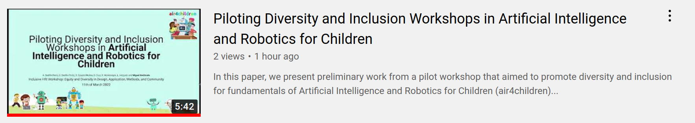

# :page_facing_up: air4children HRI2023

Authors: 
...?
Abstract:
...?

[](https://arxiv.org/abs/2203.03204) 
[](slides/slides-final.pdf) 
[](https://github.com/air4children/hri2023/blob/pdfs/workshop-paper.pdf)
[](https://github.com/air4children/hri2023/actions) 
**(This work is 100% Reproducible)**

## 5 minutes video
https://youtu.be/? 
[](https://youtu.be/?)

## Workshop Name:


## Licence and Citation 
This work is under Creative Commons Attribution-Share Alike license [](https://creativecommons.org/licenses/by-sa/4.0/). 
Hence, you are free to reuse it and modify it as much as you want and as long as you cite [this work](https://github.com/air4children/hri2023) as original reference and you re-share your work under the same terms.

### Cite as

### BibTeX to cite
```

```

## Clone repository
After generating your SSH keys as suggested [here](https://docs.github.com/en/github/authenticating-to-github/generating-a-new-ssh-key-and-adding-it-to-the-ssh-agent) or [here](https://github.com/mxochicale/tools/blob/main/github/SSH.md) with few personal notes.
You can then clone the repository by typing (or copying) the following line in a terminal at your selected path in your machine:
```
mkdir -p $HOME/repositories/air4children/ && cd $HOME/repositories/air4children/
git clone git@github.com:air4children/hri2023.git
```

## Contact 
If you have specific questions about the content of this repository, you can drop us an email to [air4children@gmail.com](mailto:air4children@gmail.com?subject="[hri2023-questions]").
If your question might be relevant to other people, please instead [open an issue](https://github.com/air4children/hri2023/issues).
